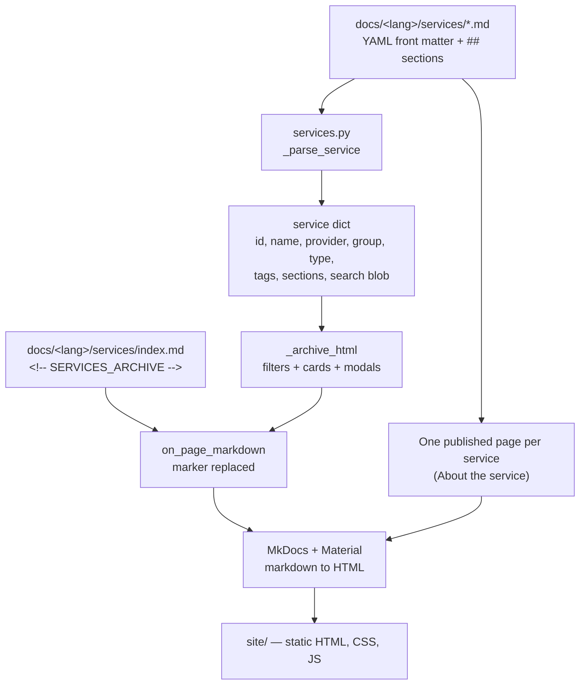
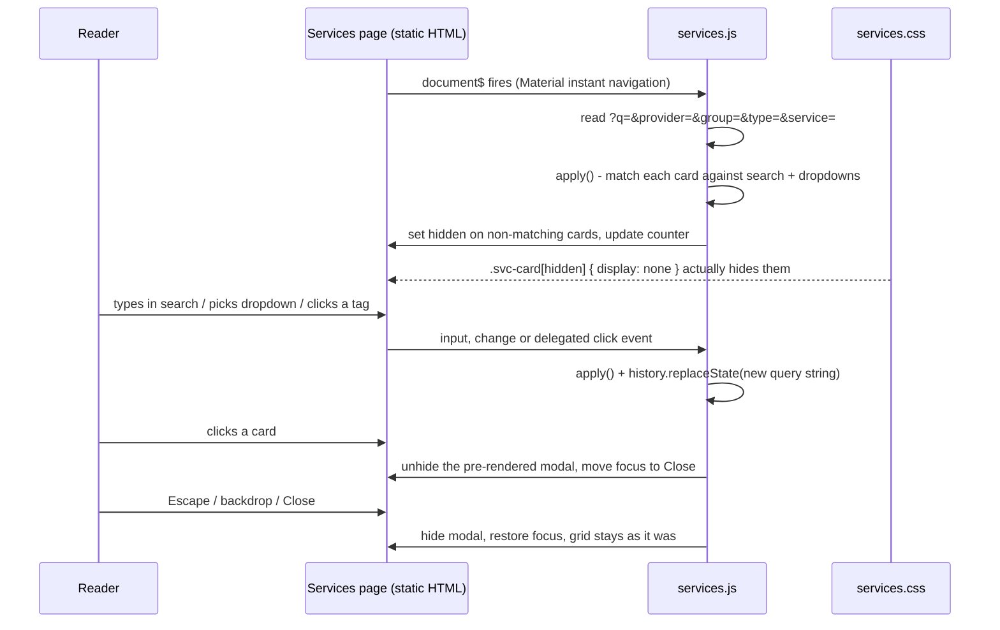

# Service catalogue


## Design decisions

+ **One markdown file per service, no registry.**
  Optimises for non-technical editors; the cost is that validation must live in the hook.
+ **State in the URL.**
  Filter and open card are shareable; `replaceState` avoids polluting browser history.
+ **Pre-rendered modals.**
  Opening a card never disturbs the filtered grid.


### Limitations of the current design

+ **Search is a plain substring match.** No stemming, fuzzy matching or word
  splitting: "lagringar" will not find "lagring". Acceptable at five services;
  revisit (`lunr.js` or a prebuilt index) beyond ~50.
+ **All cards and modals are rendered up front.** Fine for a few dozen
  services; at hundreds the page weight and DOM size will start to matter.
  Rendering modals on demand would be the first optimisation.
+ **No validation of tag values.** A typo (`Datahanering`) silently creates a
  new provider/group/type and a new dropdown option. A controlled vocabulary
  check in the hook — warning on unknown values — would catch this.
+ **The modal is not a full focus trap.** Focus moves to Close on open and is
  restored on close. Escape and backdrop work, but Tab can still reach the
  page behind the modal. Migrating to the native `<dialog>` element would fix
  this and remove code.
+ **No deep link to a section.** `?service=zenodo` opens the card, but not a
  specific section within it.
+ **Feedback and problem reporting are paused.** The original specification
  included "report a problem"/feedback buttons in the card. That needs a
  backend (the reference implementation was WordPress-based) and a static site
  has none. Space is reserved in the modal footer; an external form service or
  a pre-filled GitHub issue link is the low-effort path.
+ **MkDocs is pinned below 2.0.** MkDocs 2.0 removes the plugin system that
  Material, the i18n plugin and this hook all rely on. There is no migration
  path today; the pin in `requirement.txt` is load-bearing.
+ **Inline SVG icons bloat the HTML.** Each icon is inlined into both the
  card and the modal, so a service's icon appears twice in the output. A
  sprite sheet would be cleaner if the catalogue grows.


## How to add a new service

1. Create `docs/en/services/<slug>.md` **and** `docs/sv/services/<slug>.md`
   (same filename in both languages — the filename is the service id).
2. Copy the front matter from an existing service and fill in `name`,
   `provider`, `group`, `type`, `data`, `location`, `summary`, `access`,
   `link`, `link_requires_login`, `icon`.
3. Write the sections: `## Access` / `## Guides` / `## About the service`
   (Swedish: `## Åtkomst` / `## Guider` / `## Om tjänsten`).
4. Run `mkdocs serve` and check the card, the tags and the modal.

Nothing else needs editing: the card, the dropdown options, the tags and the
published service page are all generated. Leave a field out and it shows as
*uppgift saknas* instead of disappearing — that is intentional.

Rules that follow from our implementation:

* The **filename** becomes the service id (`zenodo.md` → `zenodo`), which is
  used in element ids and in the `?service=` URL parameter.
* Content **before the first `##`** is ignored; the card text comes from
  `summary`.
* Each `##` section becomes one expandable block in the modal, in file order.
* A missing required field does not break the build; it is logged and rendered
  as *uppgift saknas* so the gap is visible rather than silently hidden.
* `index.md` and files starting with `_` are never treated as services.


### An example service (with comments)

```markdown
---
name: Zenodo                           # required
icon: material/database-arrow-up       # any Material icon path
provider: CERN / EU                    # required — tag + dropdown
group: FAIR-resurser                   # required — tag + dropdown
type: Publicering                      # tag + dropdown
data: Öppna data                       # tag only (no dropdown)
location: EU                           # tag only (no dropdown)
summary: >
  General-purpose open repository      # required — card text,
  developed under the European         # can be multi-line (YAML syntax)
  OpenAIRE program and operated
  by CERN.
access: Open to anyone…                # searchable, shown in the card data
link: https://zenodo.org
link_requires_login: false
---

## Access
…
## Guides
1. …
## About the service
…
```


## How to add new tags or categories

* **A new value** for an existing key (a new provider, group or type): just use
  it in a service file. The dropdown option appears automatically.
* **A new tag family** (for example `license`):
  1. add `("license", "license")` to `TAG_GROUPS` in `services.py`;
  2. add `.svc-tag--license { … }` plus a `[data-md-color-scheme="slate"]`
     override in `services.css`.
  Without a dropdown, clicking the tag falls back to a free-text search — which
  is usually what you want for a secondary facet.


## How to extend filtering

To promote a tag family to a real dropdown:

1. In `services.py`, render the `<select name="license">` in `_filters_html()`
   (use `_options()`), and add `data-license="{_attr(_slug(...))}"` in
   `_card_html()`.
2. In `services.js`, add `license: form.querySelector('select[name="license"]')`
   to the `selects` object. `matches()`, the URL state, the Clear button and
   tag clicks all pick it up automatically — the key name is deliberately the
   same as the `<select name>` and the `data-*` attribute.
3. Add the label strings to both entries in `LABELS`.


## How to modify styling

Edit `docs/stylesheets/service_catalog/services.css`. Use Material's CSS
variables rather than literal colours so light and dark mode both work. Keep
hover and `:focus-visible` states — they are the only affordance these plain
HTML controls have.

**Never remove** `.svc-card[hidden] { display: none; }` or
`.svc-modal[hidden] { display: none; }`. They override the browser's weaker
built-in `[hidden]` rule; without them, filtering and modals silently stop
working (the counter keeps updating, but nothing is hidden).


## Fixed, but worth remembering

**Filtering hid nothing (fixed).**
Cards were marked `hidden`, but `.svc-card { display: flex }` outranked the
browser's built-in `[hidden] { display: none }`. So the cards stayed visible
while the counter correctly showed "1 of 5".

Fixed with an explicit

```css
.svc-card[hidden] { display: none; }
```

Any future element that both sets `display` and gets hidden this way needs the
same companion rule — `.svc-modal[hidden]` already has one.


## Notes in detail

> **Class-name contract spread across `services.py`, `services.js`, and `services.css`**
  without a shared constant. This is a typical AI output shape: correct, but coupling that
  is only visible if you read all three files.


### Card generation

`_collect()` scans the folder that contains the overview page — service files
live next to `index.md`, so the hook needs no configured path. Each file goes
through `_parse_service()` into a plain dict, the list is sorted by provider
then name (stable output between builds), and `_card_html()` renders:

```html
<article class="svc-card" id="svc-card-zenodo"
  data-provider="cern-eu" data-group="fair-resurser" data-type="publicering"
  data-tags="cern-eu fair-resurser publicering oppna-data eu"
  data-search="zenodo cern / eu fair-resurser publicering …">
  <button class="svc-card__open" data-open="zenodo"> … </button>
  <div class="svc-card__tags"> … </div>
</article>
```

The `data-*` attributes are the **entire filtering interface**. The JavaScript
knows nothing about services, only about these attributes.


### Filtering logic

Three dropdowns (`provider`, `group`, `type`) are generated from the values
found in the service files themselves — `_options()` de-duplicates by slug and
skips *uppgift saknas*. Adding a new provider in a markdown file therefore adds
a new filter option automatically.

`matches(card)` in the JavaScript returns true only when the card passes every
active control. Dropdown comparison is done on **slugs** (`_slug()` in Python
produces the same value for the option and for the card attribute), which makes
matching immune to case, spaces and punctuation.


### Search logic

The search field matches a single lowercase string, `data-search`, built at
build time from `name`, `provider`, `group`, `type`, `summary`, `access` and
all tag labels. Matching is a plain substring test (`indexOf`), so:

* it is instant even without a search library,
* it is case-insensitive,
* it does **not** do stemming, fuzzy matching or word splitting — searching
  "lagring" finds services whose text contains exactly that string.

Full-text search across the whole site is separate: that is Material's own
search plugin, which indexes the published service pages.


### Modal windows

Every service gets a modal rendered up front and hidden. Opening one only
toggles `hidden`, which is why closing it returns the reader to exactly the
filtered grid they came from.

* Only one modal can be open (`openModal` closes any other first).
* Focus moves to the `Close` button on open and returns to the triggering card
  on close.
* Escape, the backdrop and the `Close` button all close it.
* `role="dialog"`, `aria-modal="true"` and `aria-labelledby` are set on the
  container; `body.svc-modal-open` stops the page behind from scrolling.
* Sections are native `<details>` elements, so they expand without JavaScript.

Actions: **About the service** links to the generated service page;
**To the service** is the external link, annotated "(sign-in required)" when
`link_requires_login: true`.


### Category and tag system

`TAG_GROUPS` in `services.py` defines both the front matter keys that become
tags and their colour class:

| Key        | CSS class            | Dropdown? | Click behaviour |
| ---        | ---                  | ---       | ---             |
| `provider` | `.svc-tag--provider` | yes       | selects that provider |
| `group`    | `.svc-tag--group`    | yes       | selects that function group |
| `type`     | `.svc-tag--type`     | yes       | selects that service type |
| `data`     | `.svc-tag--data`     | no        | free-text search on the label |
| `location` | `.svc-tag--location` | no        | free-text search on the label |

Clicking an already-active tag clears it again (toggle). Tags are real
`<button>` elements, so they are keyboard-reachable.


### CSS structure

`services.css` is organised in commented blocks:
filter bar → card grid → tags → modal → buttons and footer.
Conventions:

* Colours use Material's CSS variables (`--md-default-bg-color`,
  `--md-accent-fg-color`) so the catalogue follows the site palette and the
  light/dark toggle.
* The only literal colours are the five tag families, each with a
  `[data-md-color-scheme="slate"]` override for readable contrast in dark mode.
* Hover and `:focus-visible` states are defined for every interactive element
  (filters, cards, tags, buttons, modal close).
* Naming is [BEM-like](https://bem.info/en/methodology/naming-convention):
  block `svc-card`,
  element `svc-card__title`,
  modifier `svc-tag--provider`.


### JavaScript event handling

* **Initialisation** runs through Material's `document$` observable, because
  instant navigation swaps the page body without a reload. A `data-ready` flag
  on the archive keeps it idempotent.
* **One delegated click listener** on `.svc-archive` handles cards
  (`[data-open]`), close targets (`[data-close]`) and tags (`.svc-tag`) — no
  per-element wiring, which matters because the markup is generated.
* **`input`** on the search field and **`change`** on the dropdowns re-run
  `apply()`; **Escape** closes the modal via a document-level listener.
* **URL state** is written with `history.replaceState`, so typing does not fill
  the browser history. Reloading or sharing
  `…/services/?q=lagring&provider=kth&service=kth-onedrive` restores both the
  filter and the open card.


### Build-time data flow



### Runtime (in the reader's browser)



Everything happens against markup that already exists in the page. No data is
fetched at runtime, which is why the catalogue works on GitHub Pages and
other static site setups.
